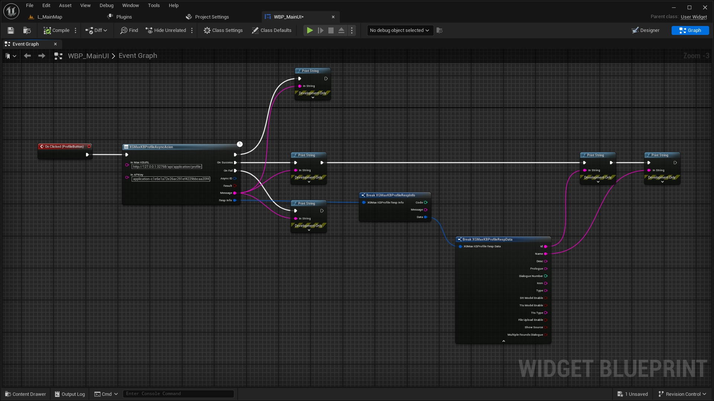
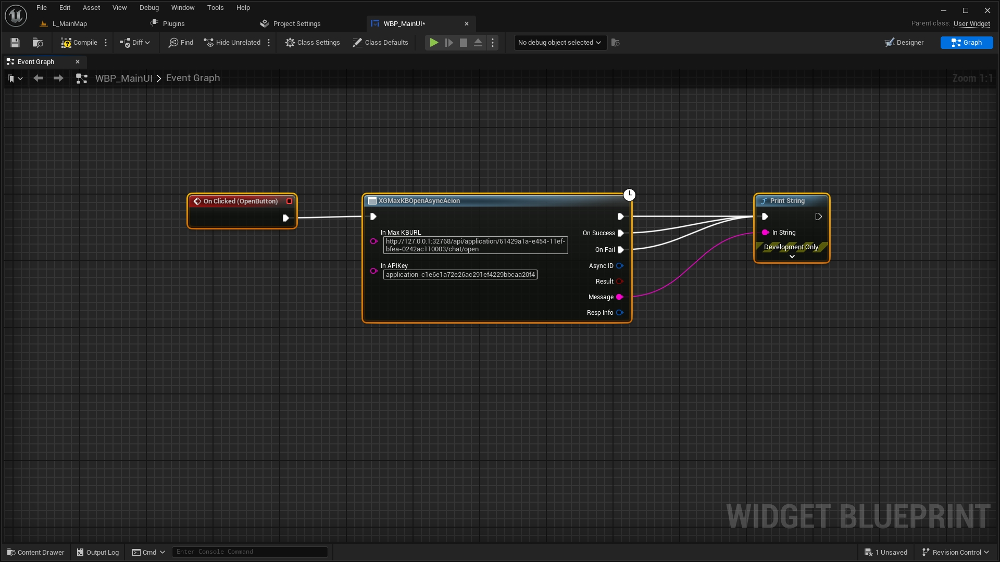
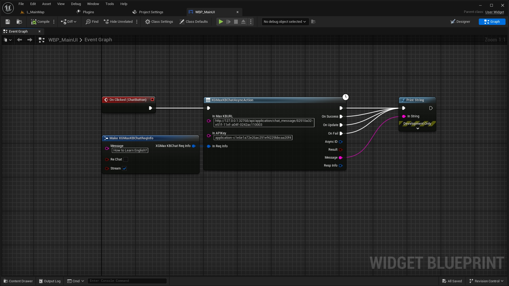

# XGMaxKBLink
Plugin Version:1.0
- [XGMaxKBLink](#xgmaxkblink)
  - [Brief](#brief)
  - [Code base introduction](#code-base-introduction)
    - [Folder DocumentPictures:](#folder-documentpictures)
    - [Folder XGMaxKBDemo:](#folder-xgmaxkbdemo)
  - [Use process](#use-process)
    - [1. Check that local MaxKB is running properly](#1-check-that-local-maxkb-is-running-properly)
    - [2. Use the Blueprint node for access](#2-use-the-blueprint-node-for-access)
      - [Get Profile](#get-profile)
      - [Open Session](#open-session)
      - [Chat](#chat)
  - [Contact](#contact)

## Brief
Connect the engine plug-in to Unreal Engine 5 and MaxKB 
English document: 
[English Instruction](./README.md) 
中文文档: 
[Chinese Instruction](./README_CN.md) 
Mall link: 
TODO  
Note: 
1.You need to deploy MaxKB locally 
2.Ensure that the MaxKB API test process can pass 
3.This plugin was developed by Huagang Liu, does not contain any code other than Unreal Engine code, does not store your application information, etc 
## Code base introduction
### Folder DocumentPictures:  

Various pictures in the document

### Folder XGMaxKBDemo:
UE_5.3 development example project 
It requires a UEC++ development environment on the computer to work normally 
## Use process
a. Obtain information about the APP to be accessed through the APIKey (for example,AppID,AppName); 
b. Create a new dialog using AppID and obtain the ID of the dialog 
c. Hold a conversation with the dialog ID (if the dialog ID is known, it is not necessary to obtain it repeatedly) 
### 1. Check that local MaxKB is running properly
You should access MaxKB's application on a local server and run a dialogue test  
You should get the required APIKey,APPID, etc.  
You need to confirm the local IP and port.
### 2. Use the Blueprint node for access

#### Get Profile
  
#### Open Session
  
#### Chat
  

## Contact

If you have any questions about XGOllamaLink plug-in products, please contact me.

QQ:
709777172  

Email:
709777172@qq.com  

bilibili:
[虚幻小刚](https://space.bilibili.com/8383085)  