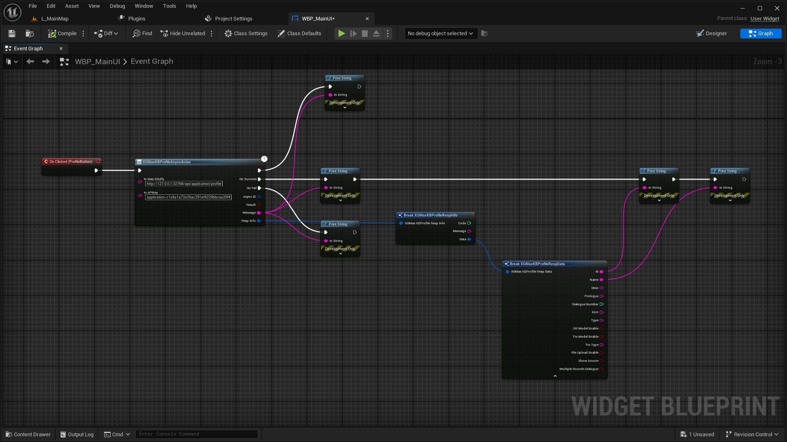
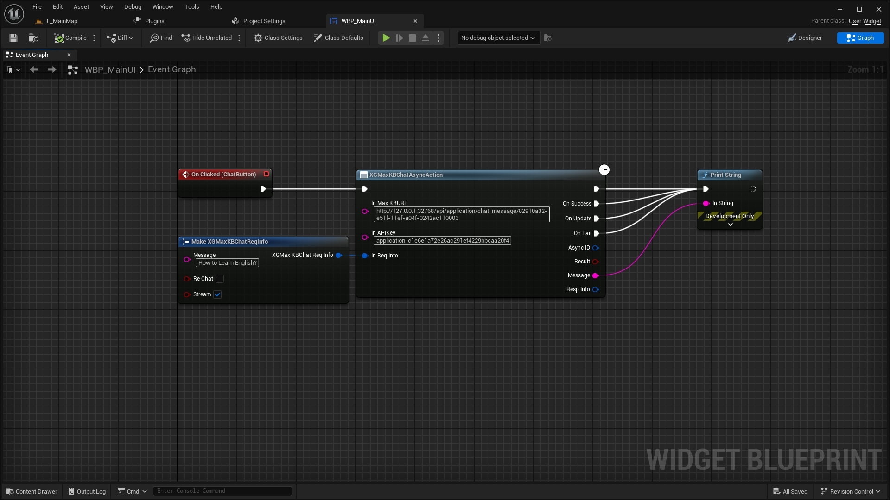

# XGMaxKBLink
Plugin Version:1.0
- [XGMaxKBLink](#xgmaxkblink)
  - [简介](#简介)
  - [代码库介绍](#代码库介绍)
    - [文件夹 DocumentPictures:](#文件夹-documentpictures)
    - [文件夹 XGMaxKBDemo:](#文件夹-xgmaxkbdemo)
  - [使用流程](#使用流程)
    - [1.确认MaxKB运行正常](#1确认maxkb运行正常)
    - [2.通过蓝图节点进行访问](#2通过蓝图节点进行访问)
      - [通过APIKey获取APPID](#通过apikey获取appid)
      - [通过APPID创建并获取会话ID](#通过appid创建并获取会话id)
      - [通过蓝图节点进行对话](#通过蓝图节点进行对话)
  - [联系方式](#联系方式)

## 简介
连接虚幻引擎5和MaxKB的引擎插件 
英文文档: 
[English Instruction](./README.md) 
中文文档: 
[Chinese Instruction](./README_CN.md) 
商城链接: 
TODO  
注意: 
1.你需要在本地部署MaxKB 
2.确保MaxKB自带的API测试流程可以通过 
3.本插件由小刚开发,不包含虚幻引擎代码以外的任何代码,不会存储你的应用信息等 
## 代码库介绍
### 文件夹 DocumentPictures:  

文档中的各类图片  

### 文件夹 XGMaxKBDemo:
UE_5.3的开发示例工程 
需要电脑上具备UEC++开发环境方可正常使用 
## 使用流程
### 1.确认MaxKB运行正常
你应该在本地服务器访问MaxKB的应用并进行对话测试 
你应当获取所需要的APIKey,APPID等信息 
你需要确认本地的IP和端口
### 2.通过蓝图节点进行访问

#### 通过APIKey获取APPID
  
#### 通过APPID创建并获取会话ID
  
#### 通过蓝图节点进行对话
  

## 联系方式

如果有任何XGMaxKBLink插件产品问题,请联系我.  

QQ:
709777172  

Email:
709777172@qq.com  

bilibili:
[虚幻小刚](https://space.bilibili.com/8383085)  